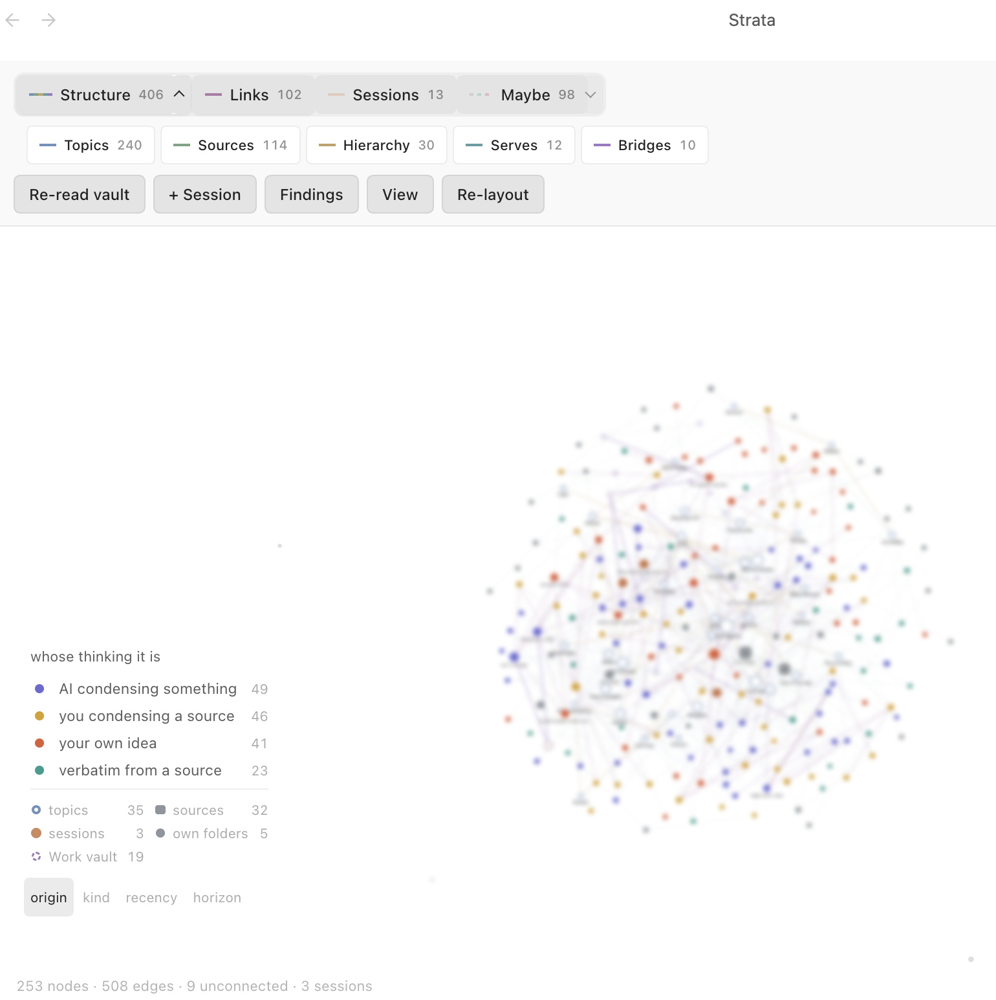

# Strata

A layered graph workspace for Obsidian. Every edge knows what kind of edge it is.



*Node labels are blurred: this is the author's own vault. The four groups across
the top are the layers, and everything under **Maybe** is drawn as a broken line
because nothing has confirmed it.*

## The problem

Obsidian's graph view is a hairball for one structural reason: **every edge means
the same thing.** A connects to B, and the view cannot tell you why. It is several
different graphs superimposed and then flattened into one.

Strata separates them. The graph becomes a stack of layers — each layer a
different *kind* of relation — that can be toggled, filtered and combined. Nodes
stop being only notes: a node can be a topic, a source, or an AI conversation.

## Four groups, cut by who asserted the edge

Ten layers, grouped by the same question a note's `origin` asks, applied to
edges: *whose claim is this?*

| Group | What it holds |
| --- | --- |
| **Structure** | What the frontmatter says: topics, source, a topic's parent, what a piece of work is for, links that cross into a second vault. Nobody claimed these — they are read off the files. |
| **Links** | Wikilinks written in note bodies. The only layer that is a decision rather than a derivation. |
| **Sessions** | AI conversations, joined to the notes they produced. |
| **Maybe** | Edges nothing has confirmed: notes that share topics but were never linked, notes that rhyme without sharing a topic, and near-duplicates. |

That last boundary is the load-bearing one. Everything under **Maybe** is drawn
as a broken line, because a proposal is not a fact the vault can prove.

| Layer | Group | Edge |
| --- | --- | --- |
| Topics | Structure | note → what it is about |
| Sources | Structure | note → where it came from |
| Hierarchy | Structure | topic → its parent |
| Serves | Structure | a work entry → the project or course it is for |
| Bridges | Structure | links that cross between two vaults |
| Links | Links | wikilinks written in note bodies |
| Sessions | Sessions | an AI conversation → the notes it touched |
| Suggested | Maybe | shares topics, never linked — the links the vault is missing |
| Resonance | Maybe | says related things without sharing a topic |
| Echo | Maybe | near-identical. You wrote this twice |

The Structure layers are set arithmetic over frontmatter: exact, instant, and
blind to anything you did not already write down. The Maybe layers read the
prose.

## Passages, not notes

The semantic half embeds **passages**, not whole documents, and that decision
carries the design.

Comparing whole notes averages each document into one point. On a vault of a
couple of hundred notes, that discarded more than half the text outright, and
it made every long note a hub — an average sits near everything. Passages fix
the coverage,
fix the hubs, and give you something a whole-note score never could: the actual
paragraph to quote back.

Two findings come out of it, deliberately asking different questions. **Echo**
finds near-identical passages, which the schema genuinely cannot do — two notes
can say the same thing under different topics. **Resonance** finds passages that
rhyme across notes sharing no topic, the cross-domain link set arithmetic can
never reach.

A local model then reads the relation between a pair — tension, agreement,
elaboration, application — and the verdict is presented as a *reading* rather
than a fact, with the model's own reason attached so you can check it against
the passages shown beside it.

## It runs locally

Embeddings and relation reading both go through [Ollama](https://ollama.com) on
your own machine — `nomic-embed-text` for the index. **No API keys, and nothing
leaves the device.** The vaults this is built for are private; that is the whole
reason for the constraint, and it shapes what the semantic layer can be.

## Commands

| Command | What it does |
| --- | --- |
| Open the layered graph | the main view |
| Open findings | Echo, Resonance and the rest, as a working list |
| Read the vault with the local model | build or refresh the semantic index |
| Capture a thought | checks for duplicates before writing a new note |
| Split this note into atoms | turn one note that is secretly several into several |
| Add an AI session to the graph | Claude Code sessions, read off disk |
| Add a Gemini or ChatGPT conversation | added by hand — those transcripts are not local |

## The frontmatter it reads

The Structure layers need a schema. Without these fields Strata still runs, but
only the Links, Sessions and Maybe layers will have anything in them.

| Field | On | Meaning |
| --- | --- | --- |
| `topics` | notes | list of wikilinks — what this is about |
| `source` | notes | wikilink — where it came from |
| `origin` | notes | whose thinking it is |
| `horizon` | notes | `timeless` or `situational` |
| `up` | topics | the parent topic |
| `for` | work entries | list of wikilinks — the project or course this serves |
| `bridges` | either | plain `Vault/path.md` strings that cross to a second vault |

## An assistant can query it too

The same index is served over MCP, so an AI assistant can search the vault
instead of reading it. `mcp/server.py` speaks JSON-RPC over stdio and needs no
Obsidian running — the plugin writes the index, the server only ever reads it.

| Tool | What it answers |
| --- | --- |
| `search` | natural language, not keywords — returns passages with heading, origin and topics |
| `neighbours` | what a page connects to, on every layer at once |
| `get` | one page, or one section by heading |
| `status` | what the index holds, and whether it is behind the vault on disk |
| `refresh` | bring the index up to date from disk |

`indexer.py` is the plugin's indexing pass ported to Python and verified
against it down to identical vectors, which is what lets either side keep the
index current. Point it at your vaults with `STRATA_VAULT`, `STRATA_WORK` and
`STRATA_TRANSCRIPTS`.

The reason to bother: answering a question from eight retrieved passages costs
roughly 2k tokens where reading the notes folder costs a hundred thousand. The
assistant also quotes what you actually wrote rather than paraphrasing it.

## Try it

`demo/` holds a small synthetic pair of vaults carrying the schema — 16 notes,
5 topics and 3 sources in `demo/knowledge`, a project and four entries in
`demo/work` — built so every layer that can ship in a folder has something in
it, including a near-duplicate pair for Echo, a cross-topic pair for Resonance,
and bridges between the two vaults. Sessions is the exception: a session node is
a transcript you pick off your own disk, so there is nothing to put in a repo.

Open `demo/knowledge` as a vault, install the plugin, and run the graph. It is
nested a directory down on purpose: Strata finds a second vault by looking at
the directories beside the one it is running in, so a demo vault sitting at the
repo root would try to read `src/` and `node_modules/` as vaults too.

## Install

Not in the community plugin store.

```
npm install
npm run build
```

That writes `main.js` next to `manifest.json` and `styles.css`, which is
exactly the shape of a plugin folder — copy or symlink the repo into
`YourVault/.obsidian/plugins/strata/` and enable Strata in Settings →
Community plugins.

To build straight into a real vault instead, put that plugin folder's path in
a `.strata-out` file at the repo root (gitignored), or set `STRATA_OUT`.

The semantic layers need [Ollama](https://ollama.com) running locally with
`nomic-embed-text` pulled. Everything else works without it.

## Status

v0.1.0. Desktop only. Built against one vault's schema and generalised outward
from there, so expect the Structure layers to want configuring before they fit
yours.

## Licence

MIT. See [LICENSE](LICENSE).
